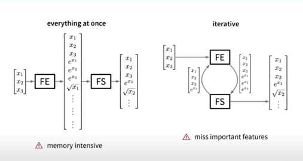

# Untitled

**\*** add logarithmic transformation. When to perform logarithmic transformations? Why to perform?

**Part I : Feature Engineering:**

_**“Feature Engineering is the process of applying domain knowledge to transform raw-data into features and obtain a subset of features that better represent the underlying problem and improve Machine Learning performance.”**_

The commonly used terminologies in feature engineering are discussed in brief below:  
\(1\) **Feature transformation** is about constructing new features from existing features; this is often achieved using mathematical mappings.  

\(2\) **Feature generation/Feature extraction** is about generating new features that are often not the result of feature transformations. For example, assuming that one does not view a pixel in an image as a feature, one generates new features for images. Moreover, it makes sense to say that features defined from patterns are generated features. Many domain-specific ways for defining features also belong in the feature generation category.

\(3\) **Feature selection** is about selecting a small set of features from a very large pool of features. The reduced feature set size makes it computationally feasible to use certain algorithms. Feature selection may also lead to improved quality on the result of those algorithms.  

There are 2 approaches in which Feature Engineering can be performed:\[7\]

1. The exhaustively large feature pool is generated first and then feature selection is performed.
2. The feature set is expanded iteratively by evaluating whether the inclusion of new features improve the prediction accuracy.

Both these approaches have their drawbacks:

The first approach is very memory intensive, especially when starting off with a large initial feature set from which the additional features are constructed via various transformations. With the second approach, important features might be missed if some variables are eliminated too early in the feature engineering process and can therefore not serve to construct more complex, possibly helpful features. Furthermore, depending on the strategy for including additional features, the whole process might either be very time intensive, if at each step a model is trained and evaluated on the feature subset, or can fail to include \(only\) the relevant features, if a simple heuristic is used for the feature evaluation and selection.

 Fig1: Feature engineering approaches

Even though, most of the feature construction frameworks follow one of the two approaches discussed above. Some might also use more complex approaches \(like Cognito which is discussed later \). The recent trend is to use meta-learning i.e, algorithms trained on other datasets to decide whether to apply a specific transformation to a feature or not.

\*\*\*\*

\*\*\*\*

  

