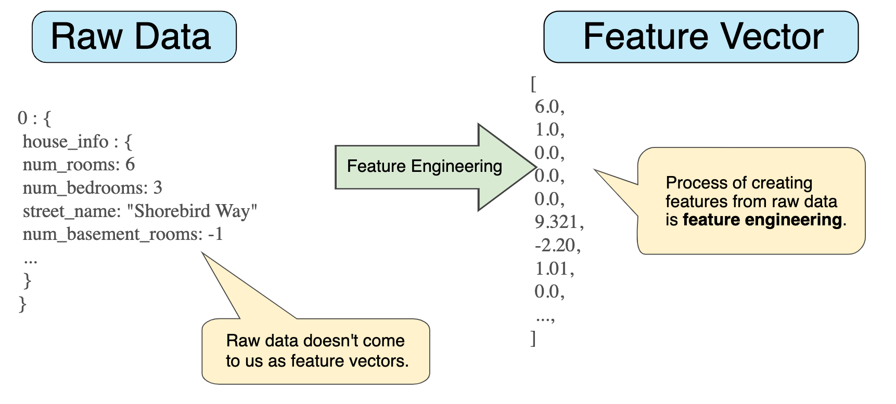

# Part I - Feature Engineering

A large number of information systems now rely hugely on Machine Learning-based prediction models to capture and predict the behaviour outcomes and likelihoods. 

At the core of building a successful predictive model is a large number of efforts to perfect the input data. This involves cleaning the data, imputing missing values, engineering existing variables, extracting the most relevant features and selecting the most optimal set of features that improve the prediction accuracy of the models.                                                                        As part of this book, we will be focusing on the Feature Engineering part of the machine learning pipeline and will also take a look at few automated feature engineering frameworks. So, let's start by defining what feature engineering is:

_**“Feature Engineering is the process of applying domain knowledge to transform raw**_ ****_**data into features and obtain a subset of features that better represent the underlying problem and improve Machine Learning performance.”**_

The successful feature engineering process is a result of 2 components:

* **Domain knowledge** or wisdom of 'what works' gained through years of experience 
* **Problem-solving-drive** while navigating through a large pool of possible choices on an unknown data and unforeseen behavior. 

\*\*\*\*

