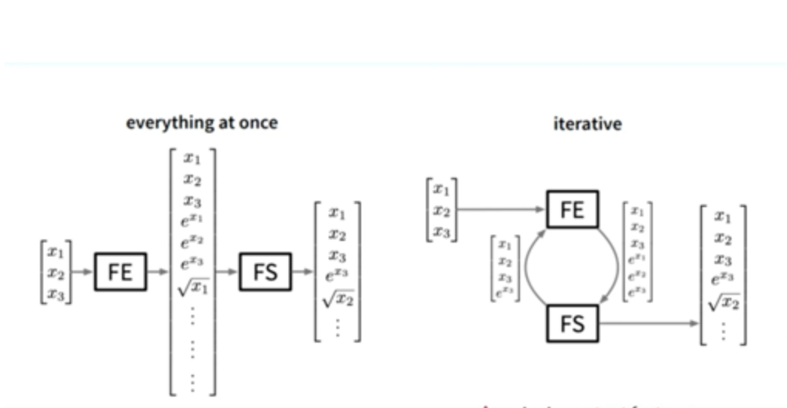

# Approaches to Feature Engineering

From a broader perspective, there are 2 common approaches to perform Feature Engineering:

#### **1. Generate an exhaustively large feature pool and then perform feature selection.**

#### **2. Iteratively expand the original feature set by evaluating whether the inclusion of new features improves the prediction accuracy of the model.** 

Both these approaches have their own drawbacks: 

The first approach is very memory-intensive, especially when starting off with a large initial feature set from which the additional features are constructed via various transformations. 

With the second approach, important features might get missed if some variables are eliminated too early in the feature engineering process and can therefore not serve to construct more complex, possibly helpful features. Furthermore, depending on the strategy for including additional features, the whole process might either be very time-intensive, if at each step a model is trained and evaluated on the feature subset, or can fail to include the relevant features if a simple heuristic is used for the feature evaluation and selection. 

  
Even though, most of the feature construction frameworks follow one of the two approaches discussed above. Some frameworks might also use more complex approaches \(like Cognito which is discussed later \). The recent trend is to use 'meta-learning' based approach to decide whether to apply a specific transformation to a feature or not as discussed below.

#### **3. Learning Feature Engineering\(LFE\) for Classification:**

As we already saw, the above two approaches incur high computational costs in runtime and/or memory. ['Learning Feature Engineering for classification'](https://pdfs.semanticscholar.org/055e/01a02c9c50cf3473126e92e352f17b71fb9b.pdf?_ga=2.7542706.1893297219.1597518077-79882967.1592103436) presents a new novel meta-learning based approach for automating feature engineering in classification tasks.

LFE is based on learning the effective transformations\(like arithmetic or aggregation operators\) on numerical features from past feature engineering experiences. Given a dataset, LFE recommends a set of useful features without relying on model evaluation or explicit feature expansion and selection. 

At the core of LFE, there is a set of Multi-Layer Perceptron \(MLP\) classifiers, each corresponding to a transformation. Given a set of features and class labels, the classifier predicts whether the transformation can derive a more useful feature than the input features. LFE considers the notion of feature and class relevance in the context of a transformation as the measure of the usefulness of a pattern of feature value and class label distributions, and transformation.  
LFE claims to outperform the other feature engineering approaches by an overwhelming majority of 89% on the datasets from various sources while incurring   
a substantially lower computational cost.

