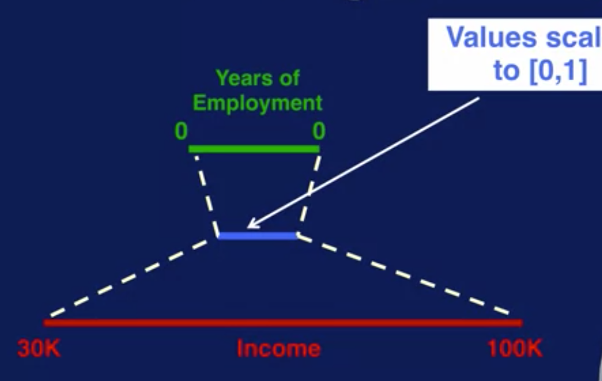

# Feature Engineering tasks

For a long time, feature engineering was considered as only 'Feature Construction'. Though that is not completely wrong, it is one of the many tasks performed as part of the feature engineering process. Some of these commonly performed tasks are mentioned below:

###  **1. Feature transformation:** 

Feature transformation is all about obtaining new features from set of existing ones. It is often achieved by using mathematical mappings\(such as log\(x\), √x, 1/x, x2, x3, \|x\|\). The most common example of feature transformation is feature scaling. 

Let's say you have a feature for income that ranges from 30,000 to 100,000. And another feature for years of employment that ranges from 0 to 50. These features have very different scales. If you want both features to have equal weighting when you compare the data samples, then you can scale the range of both features to be between 0 and 1. That way the income feature which is on a much largest scale than the years of employment feature will not dominate the compares result.

### **2. Feature generation:** 

Feature generation or feature extraction is about generating new features that are not the result of the feature transformation process. Many domain-specific ways for defining features also belong in the feature generation category.

To illustrate the importance of feature generation, consider the following example. Here we can see the original feature Date and dependent feature Visitors, which shows a date and the corresponding number of visitors for a theme park. When looking at just these features, there does not seem to be an obvious pattern between the predicting and the dependent feature. With feature generation, we can extract what kind of day the date is, shown in the IsWeekendDay column. This tells us whether the date is a weekend day or not. Now we can see a clear pattern where the number of visitors is significantly higher on weekend days than on weekdays. 

| Date  | Visitors | IsWeekend |
| :--- | :--- | :--- |
| ‘20-05-17’  | 19234  | yes |
| ‘11-04-17’ | 5735 | no |
| ‘29-01-17’ | 17914 | yes |
| ‘04-05-17’ | 5496 | no |
| ‘29-03-17’ | 5913 | no |

Table 1.1: Example features Day and Visitors and extracted feature IsWeekendDay{Day}

In many real cases, feature transformation and feature generation/extraction have the same basic significance.

### **3. Feature selection:** 

Feature selection is about finding a small subset of useful features from a very large pool of repetitive, irrelevant and noisy features. 

In practice, there are two problems that may be evoked by the irrelevant features involved in the learning process. 

* The irrelevant input features will induce greater computational cost. For example, using cached kd-trees, locally weighted linear regression’s computational expense is O\(m3 + m2 log N\) for doing a single prediction, where N is the number of data points in memory and m is the number of features used. Apparently, with more features, the computational cost for predictions will increase polynomially; especially when there are a large number of such predictions, the computational cost will increase immensely. 
* The irrelevant input features may lead to overfitting.

For example, in the domain of medical diagnosis, our purpose is to infer the relationship between the symptoms and their corresponding diagnosis. If by mistake we include the patient ID number as one input feature, an overtuned machine learning process may come to the conclusion that the illness is determined by the ID number.

 

\*\*\*\*

