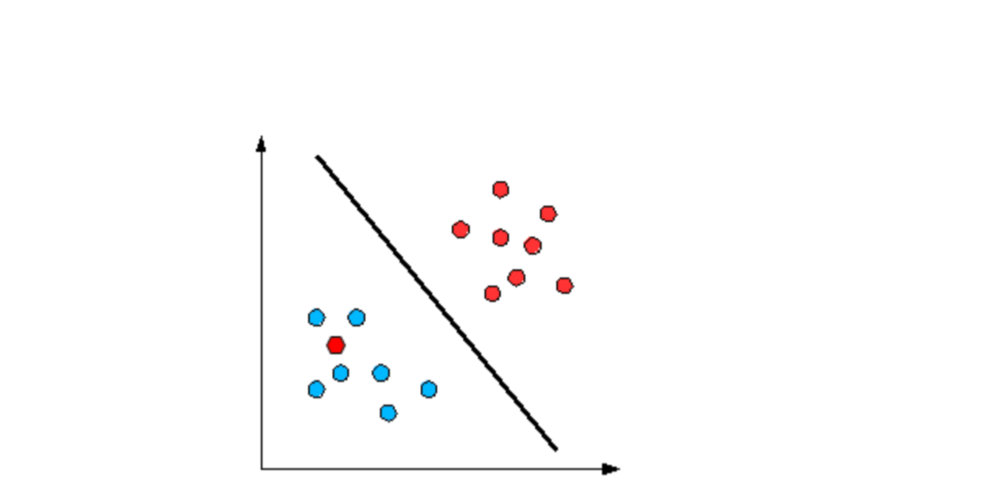

# Non-linear expansions

When the data is not linearly separable, it is preferable to increase the dimensionality of the data.

For instance, SVM is quite intuitive when the data is linearly separable. However, when it is not, SVM is extended to perform well. The first step to the nonlinear generalization of SVM is, the transformation of original training data into higher dimensional data using non-linear mapping. The next step involves finding a linear separating hyperplane in the new space.

So, if$$x1 $$and$$x2 $$are two original features, the polynomial transformation is expanded to           \($$x1, x2, x1^2, x2^2, x1x2$$ \) and the hyperplane would be of the form

\*\*\*\*$$θ0+θ1x1+θ2x2+θ3x1^2+θ4x2^2+θ5x1x2=0$$   
****

