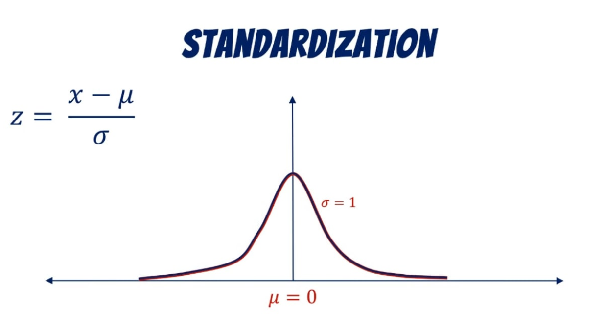

# Standardization \(or Z-Score normalization\)

Standardization or Z-Score normalization is for features that have different scales but refer to the same comparable objects.

For instance, a pattern x = \[x1,x2\] where x1 is a width in meters and x2 is height in centimeters. Both can be compared, added or subtracted but not before appropriate normalization. Z-score normalization rescales features to have properties of the standard normal distribution, mu =0 and sigma = 1. The following classical centering and scaling of the data is often used

‌

where$$μ$$and$$σ$$are mean and standard deviation of feature _'x'_ over training examples respectively.

Standardization is not only important for comparing measurements but also other machine learning algorithms like Gradient descent, k-Nearest Neighbour algorithms and Clustering algorithms  

