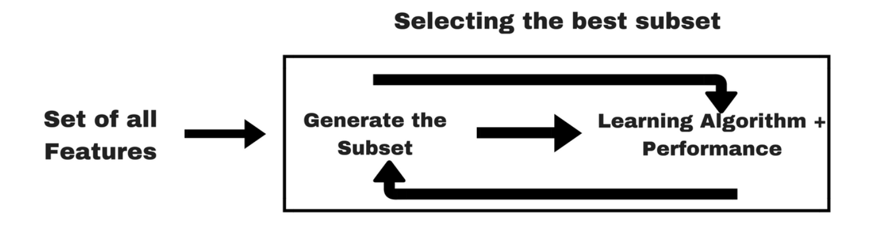

# Embedded methods

Embedded methods combine the qualities’ of filter and wrapper methods. It’s implemented by algorithms that have their own built-in feature selection methods.

Some of the most popular examples of these methods are LASSO and RIDGE regression which have inbuilt penalization functions to reduce overfitting.

* Lasso regression performs L1 regularization which adds penalty equivalent to the absolute value of the magnitude of coefficients.
* Ridge regression performs L2 regularization which adds penalty equivalent to the square of the magnitude of coefficients.

