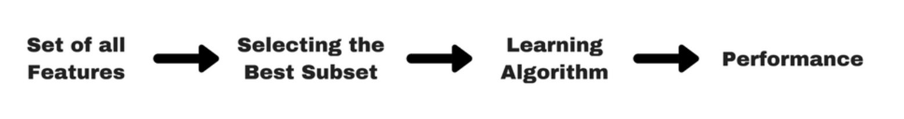

# Filters

Filter methods are generally used as a preprocessing step. The selection of features is independent of any machine learning algorithms. The features are selected based on a performance evaluation metric calculated directly from the data, without direct feedback from predictors that will finally be used on data with a reduced number of features.

