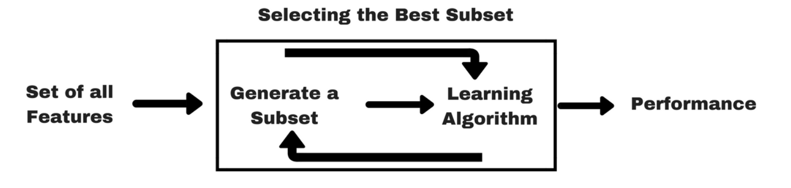

# Wrappers

These algorithms are wrapped around predictors\(predictive models\) providing them subsets of features and receiving their feedback \(usually accuracy\). These wrapper approaches are aimed at improving the results of the specific predictors they work with.

