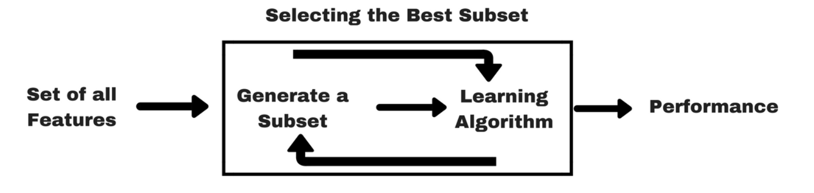

# Wrappers

These algorithms are wrapped around predictors\(predictive models\) providing them subsets of features and receiving their feedback \(usually accuracy\). These wrapper approaches are aimed at improving the results of the specific predictors they work with.

Let’s consider an example. Say we have a data set with 10 attributes \(features, variables, columns\) and one label \(target, class\). The label column is the one we want to predict. We’ve trained a model on this data and determined the accuracy of the model built on data is 62%. Can we identify a subset of those 10 attributes where a trained model would be more accurate?

We can depict any subset of 10 attributes as bit vectors, i.e. as a vector of 10 binary numbers 0 or 1. Zero means that the specific attribute is not used, and 1 depicts an attribute that is used for this subset. If we want to indicate that we use all 10 attributes, we would use the vector \(1 1 1 1 1 1 1 1 1 1\). Feature selection is the search for such a bit vector that produces the optimal accuracy. One possible approach for this would be to try out all the possible combinations. Let’s start with using only a single attribute. The first bit vector looks like this:

As we can see, when we use the first attribute we come up with an accuracy of 68%. That’s already better than our accuracy with all attributes, 62%.  But can we improve this even more? Let’s try using only the second attribute:

Still better than using all 10 attributes, but not as good as only using the first.

We could continue to go through all possible subsets of size 1. But why we should stop there?  We can also try out subsets of 2 attributes now:

Using the first two attributes immediately looks promising with 70% accuracy. We can collect all accuracies of these subsets until we have tried all of the possible combinations:

We call this a _brute force_ approach. The number of combinations for 10 attributes which results in 2 x 2 x 2 x … = 2^10 or 1,024-1 different outcomes. And it will get even more complicated as the number of features increase.

