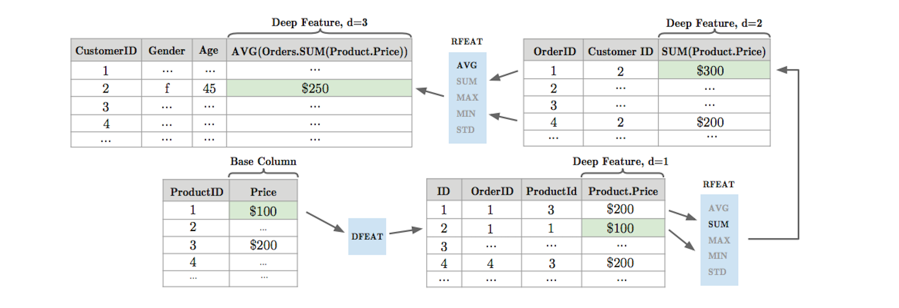

# Deep Feature Synthesis\(DFS\)

DFS is an algorithm that generates features for relational datasets by stacking calculations sequentially. This algorithm is proposed by Max and Kalyan in **“**[**Deep feature synthesis: Towards automating data science endeavors**](https://dai.lids.mit.edu/wp-content/uploads/2017/10/DSAA_DSM_2015.pdf)**”**. It follows relationships in the data to a base field and then sequentially applies mathematical functions along that path to create the final set of features.

The input to DFS is a set of interconnected entities and the tables associated with them. Notationally, for a given dataset,

E: entity table with J features

Now, given the entities, their corresponding data tables and relationships, the mathematical functions are applied at 2 different levels:

* Entity level
* Relational level

**\[A\] Entity level:** These are the transformations on a single table by creating new features using computational functions element-wise to the jth column.

These transformations include conversion of a categorical string to predecided unique numerical value or translation of temporal data into weekday, DayOfTheMonth, MonthOfTheYear, HourOfTheDay, etc.

**\[B\] Relational level:** These are derived by jointly analyzing 2 or more entities and the relationship between them. It can be either a forward or a backward relationship.

**\(i\) Forward**: A forward relationship is between an instance m of entity E^l and a single instance of another entity i in E^k . This is considered the _forward_ relationship because i has an explicit dependence on m.

**Direct features\(dfeat\)**: These are applied over forward relationships. The features are directly transformed as features of another entity.

**\(ii\) Backward**: The backward relation is the relationship from an instance i in E^k to all the instances m = {1…M} in E^l that have a forward relationship to k.

**Relational features \(rfeat\)**: Relational features are applied over the _backward_ relationships. They are derived for an instance i of entity E^k by applying a mathematical function to x^l, which is a collection of values for :,j \|e^k =i feature j in related entity E^l, assembled by extracting all the values for feature j in entity E^l where the identifier of E^k is e^k = i.

Some examples of rfeat functions are aggregate functions like _min_, _max_, and _count_.

Here, is an example showing the recursive generation of features. The average order size for each customer is calculated by performing a stack of intermediate calculations starting with the Product entity.

