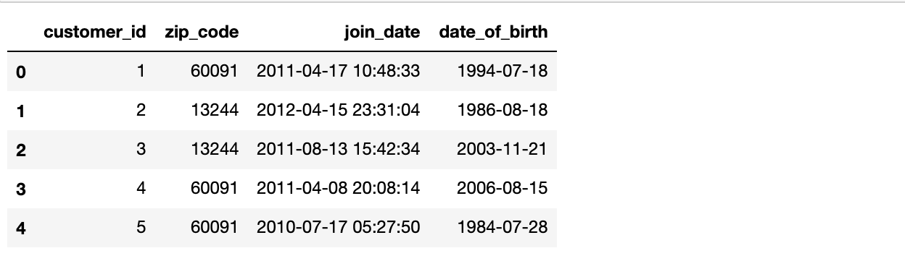
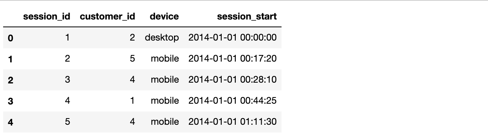
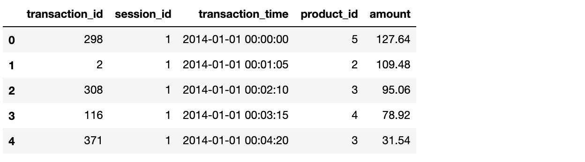
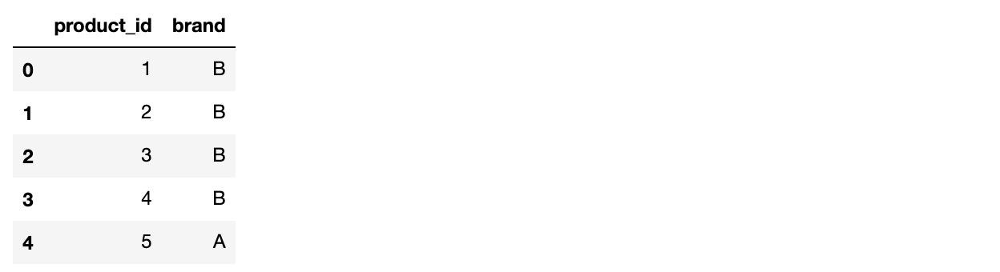
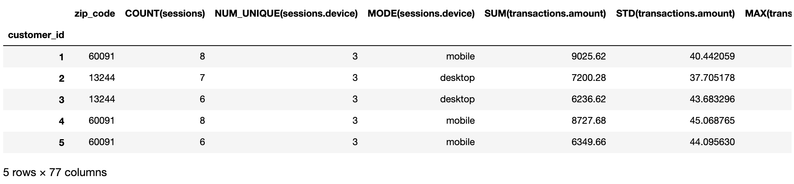
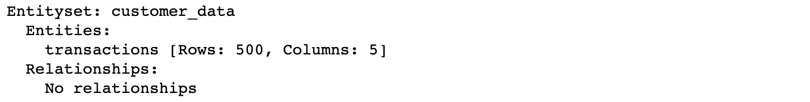
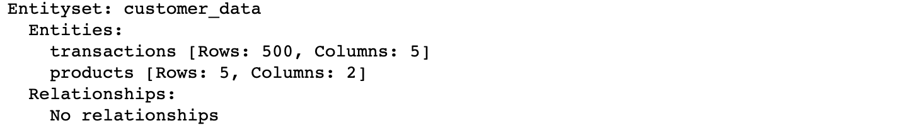
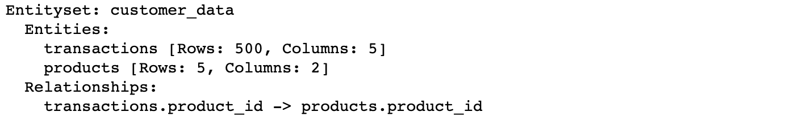
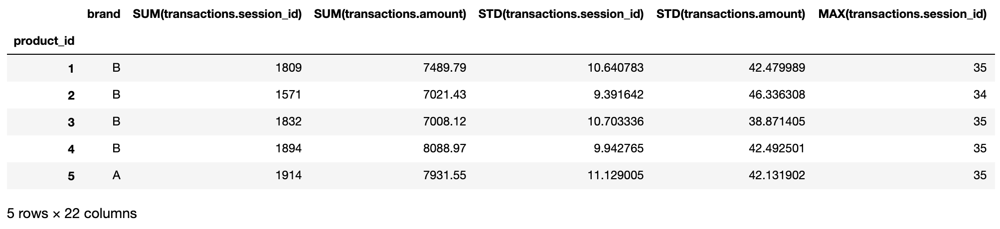

# Implementation of FeatureTools for FE:

You can find lots of examples of featuretools implementation at ‘[**featuretools demos**](https://www.featuretools.com/demos/)**’.** I will be using one of the mock datasets to explain this tool in brief.

**Install featuretools:**

```text
# Install featuretools
!pip install featuretools
```

```text
#import featuretools and other relevant libraries
import featuretools as ft
import numpy as np
import pandas as pd
import matplotlib.pyplot as plt
import seaborn as sns
sns.set()
```

**Load Mock data:**

This toy data has 3 entities:  
customers: list of customers with unique customer\_id and other relevant attributes  
sessions: unique sessions, joined to customer entity using customer\_id  
transactions: list of events

```text
#loading mock data
data = ft.demo.load_mock_customer()

customers_df = data['customers']
sessions_df = data['sessions']
transactions_df = data['transactions']
products_df = data['products']
customers_df.head()
```



```text
sessions_df.head()
```



**Running Deep Feature Synthesis:**

As already stated in the description of DFS, **the minimal input to DFS is a set of entities, a list of relationships, and the “target\_entity” to calculate features for**.  
The output of DFS is a feature matrix and the corresponding list of feature definitions for the given target entity.  
So, we need to perform 2 tasks:

1. define a dictionary of all the entities
2. relationship between them When 2 entities have a many-to-one relationship then one entity is called ‘parent’ and the other is called the ‘child’ entity. And the relationship is defined as:  **\(parent\_entity, parent\_variable, child\_entity, child\_variable\)**

```text
transactions_df.head()
```



```text
products_df.head()
```



```text
#dictionary of entities:
entities = { 'customers' : (customers_df,'customer_id'),
             'sessions' : (sessions_df,'session_id','session_start'),
             'transactions' : (transactions_df,'transaction_id','transaction_time'),
             'products' : (products_df,'product_id')
    
}

#Specify relationship between the entities. 
relationships = [('customers','customer_id','sessions','customer_id'),
                 ('sessions','session_id','transactions','session_id'),
                 ('products','product_id','transactions','product_id')
                ]

#creating feature matrix for each customer

feature_matrix_customers, feature_defs = ft.dfs(entities = entities, relationships = relationships, 
                                                target_entity = 'customers')

feature_matrix_customers
```



Similar feature matrices can be created for other entities by changing the ‘target\_entity’ value in the ft.dfs\(\).

**Using EntitySets:**

Featuretools take ‘entities’ and ‘relationships’ as separate entities, but it is advisable to use **EntitySets**. EntitySet is a collection of entities and the relationships between them. They are useful for preparing raw, structured datasets easily for feature engineering.  
While creating **EntitySet**, we add each entity one by one.

In **entity\_from\_dataframe\(entity\_id,dataframe,index,time\_index,variable\_type\)**:  
**entity\_id** : entity name,  
**index**: a column that acts as a unique identifier  
**time\_index**: tells featuretools when the data was created  
**variable\_type**: allows user to indicate the type of column

```text
#Giving name to the EntitySet(optional). I have named this EntitySet as 'customer_data':
es = ft.EntitySet(id = 'customer_data')

#Adding entities to this EntitySet. We will add each dataframe as entity. 
#Lets start with transactions dataframe.
es = es.entity_from_dataframe(entity_id = 'transactions',
                              dataframe = transactions_df,
                              index = 'transaction_id',
                              time_index = 'transaction_time')
es           
```



```text
#add another entity
es = es.entity_from_dataframe(entity_id = 'products',
                              dataframe = products_df,
                              index = 'product_id',
                              )
es
```



```text
#Once entities are added to the EntitySet, we can define relationship between them.
# When specifying relationships we list the variable in the parent entity first.

new_relationship = ft.Relationship(es['products']['product_id'],es['transactions']['product_id'])
es = es.add_relationship(new_relationship)
es
```



```text
#Creating feature matrix using EntitySet instead of seperately specifying entities and relationships:

feature_matrix, feature_defs = ft.dfs(entityset=es, target_entity='products')
feature_matrix
```



I believe it is a great and the easiest tool to quickly generate large amount features but like any other feature generation tool, it also leads to the [‘**curse of dimensionality**’](../../part-i/some-important-concepts.md#4-curse-of-dimensionality) for which feature selection is required. Also, it cannot be used for non-relational or unstructured data.

So, at a beginner level, it is a good tool to understand feature generation easily. To perform Feature Engineering for non-relational and unstructured data, [AutoFeat](../2.-autofeat/) can be used. AutoFeat is the only general-purpose library for automatic feature generation and selection. 

For more notebooks on FeatureTools: [Github](https://github.com/pa-shri/featuretools)

