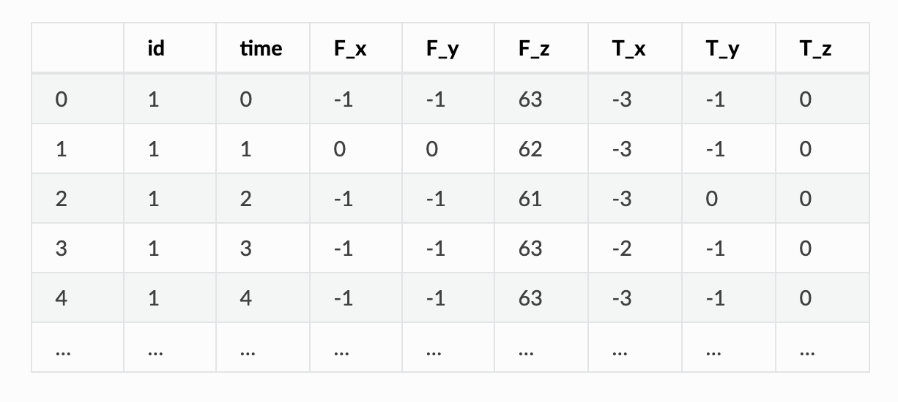
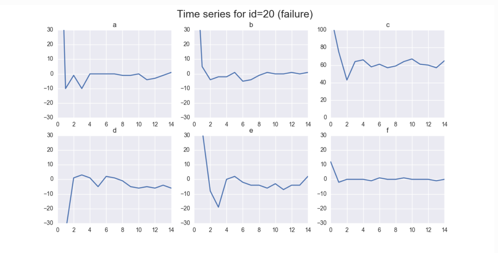
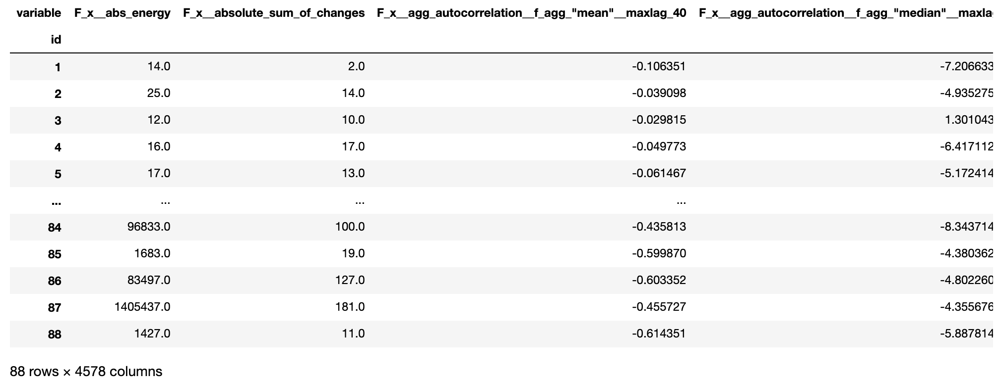
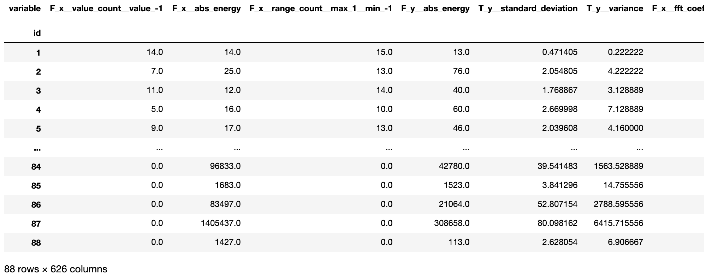

# Implementation of TsFresh for FE

**Install TsFresh:**

```python
#install tsfresh
!pip install tsfresh
```

The dataset contains robot failures discussed in more detail [here](http://archive.ics.uci.edu/ml/datasets/Robot+Execution+Failures). It contains time series data recorded by 6 sensors from 88 robots. The second dataset contains information on whether a failure was reported by the robot or not. For each sample denoted by a different id, we are going to classify if the robot reports a failure or not. 

**Load data:**

```python
from tsfresh.examples.robot_execution_failures import download_robot_execution_failures,load_robot_execution_failures
download_robot_execution_failures()
timeseries, y = load_robot_execution_failures()
print(timeseries.head())
```



The first column is the index column and has no meaning here. There are six different time series \(a-f\) for the different sensors. The different robots are denoted by the id column. 


On the other hand, 'y' contains the information on which robot reported failure and which not. 

Here, for the samples with ids 1 to 5 no failure was reported. In the following we illustrate the time series of the sample id 3 reporting no failure:

```python
import matplotlib.pyplot as plt
timeseries[timeseries['id'] == 3].plot(subplots=True, sharex=True, figsize=(10,10))
plt.show()
```


And for id=20 reporting a failure:

```python
timeseries[timeseries['id'] == 21].plot(subplots=True, sharex=True, figsize=(10,10))
plt.show()
```



For extracting all features, we do:

```python
from tsfresh import extract_features
extracted_features = extract_features(timeseries, column_id="id", column_sort="time")
```

TsFresh has automatically extracted 4578 different features. 



We will now remove all `NaN` values \(that were created by feature calculators, than can not be used on the given data, e.g. because it has too low statistics\) and select only the relevant features next:

```python
from tsfresh import select_features
from tsfresh.utilities.dataframe_functions import impute

impute(extracted_features)
features_filtered = select_features(extracted_features, y)
features_filtered
```



Now, we are left with only around 600 features.

Further, rather than writing the above code, we can even perform the extraction, imputing and filtering at the same time with the `tsfresh.extract_relevant_features()` function:

```python
from tsfresh import extract_relevant_features

features_filtered_direct = extract_relevant_features(timeseries, y,
                                                     column_id='id', column_sort='time')
features_filtered_direct
```


