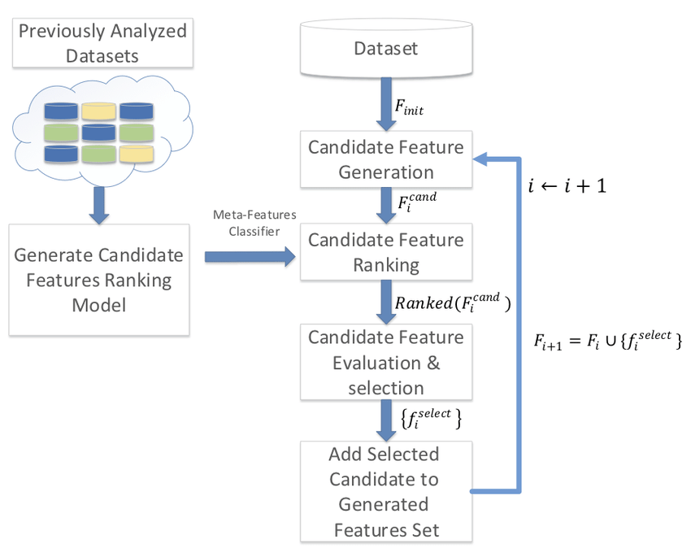

# 4. ExploreKit

Explorekit is an automated feature engineering framework that generates transformed features by combining features from the original set using commonly used operators\(discussed in 3.1\) and chooses the subset to add based on the empirical performance of the models trained with candidate features. 

It uses a meta-learning based approach to rank candidate features. The meta-features represent the dataset and the candidate features and are used to train the feature ranking classifier.

  

