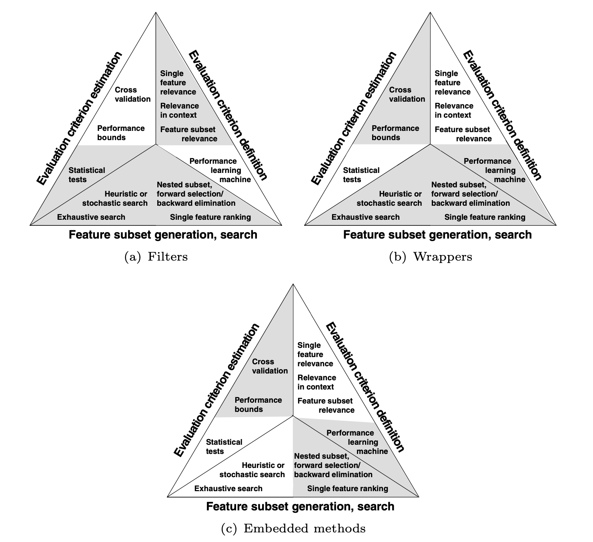

# Untitled

**Part III: Feature Selection:**

We have created all these features which might seem relevant, but they also increase the dimensionality of the dataset and thereby immerse the relevant information in the sea of possibly irrelevant, noisy or redundant features. Which gives rise to the question, ‘How do we know when a feature is relevant or informative?’

That is when Feature selection comes in picture.

Reasons to perform feature selection:

1. **General data reduction:** limit storage requirement and increase algorithm speed
2. **Feature set reduction:** save resources in the next round of data collection or data utilization
3. **Performance improvement:** to gain predictive accuracy
4. **Data understanding:** gain knowledge about the data that generated the data or simply visualize the data.

Generally used feature selection techniques/ principal approaches for feature selection:

1. **Filters:** Filters are identified to rank features using feature relevance index. The computed ranking indices include correlation coefficient, statistical tests like T-test, F-test,Chi-test etc. Generally, methods that select features without optimizing the performance of the predictive model are referred to as ‘filter’.
2. **Wrappers:** Wrappers score a subset of features according to their predictive power.
3. **Embedded methods:** Embedded methods perform feature selection in the process of training and are usually specific to given learning machines.

Wrappers and embedded methods may yield very different feature subsets under small perturbations of the dataset. To minimize the effect, ensemble methods are used to improve feature set stability.

**Aspects of feature selection:**

1. Feature subset generation\( or search strategy\)
2. Evaluation criterion definition\(like relevance index or predictive power\)
3. Evaluation criterion estimation\( or assessment method\)

Fig: The three principal approaches of feature selection. The shades show the components used by the three approaches: filters, wrappers and embedded methods.

