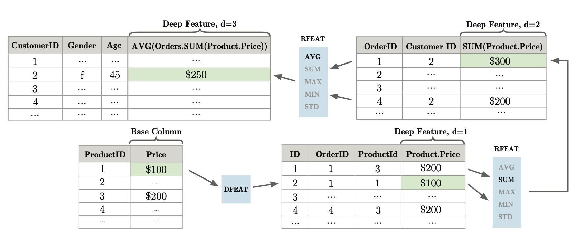

# Untitled

**Part IV: Automated Feature Engineering:**

Automated Feature Engineering optimises the process of building and deploying accurate ML models by handling necessary but tedious tasks so that the Data Scientist can focus on other important steps.

**AutoFE Tools:**

In the last few years, many tools to automate feature engineering processes have been created. They are as follows:

1. FeatureTools

2. AutoFeat

3. TsFresh

4. **Cognito**

5. **OneBM**

6. **ExploreKit**

7. PyFeat

8. AutoLearn

**1. FeatureTools:**

Featuretools is a framework to perform automated feature engineering. It is also the first python open source library to creare features from a set of relational tables. It excels at transforming temporal and relational datasets into matrices for Machine Learning.\[2\]

FeatureTools is based on a method known as ‘**Deep Feature Synthesis**’ \(The name Deep Feature Synthesis comes from the algorithm’s ability to stack primitives to generate more complex features. Each time we stack a primitive we increase the “depth” of a feature!\)\[3\]

**Deep Feature Synthesis:**

DFS is an algorithm that generates features for relational datasets by stacking calculations sequentially. This algorithm is proposed by Max and Kalyan in \[4\]. It follows relationships in the data to a base field and then sequentially applies mathematical functions along that path to create the final set of features.

The input to DFS is set of interconnected entities\* and the tables associated with them. Notationally, for a given dataset,

E: entity table with J features

xi,j^k : value of feature j for ith instance of kth entity.

Now, given the entities, their corresponding data tables and relationships, the mathematical functions are applied at 2 different levels:

Entity level

Relational level

**\[A\] Entity level:**

 These are the transformations on a single table by creating new features using computational functions element wise to the jth column.

These transformations include, conversion of a categorical string to pre decided unique numerical value or translation of temporal data into weekday, day of the month,etc.

**\[B\] Relational level:**

 These are derived by jointly analysing 2 or more entities and the relationship between them. It can be either a forward or a backward relationship.

 \(i\) Forward : A _forward_ relationship is between an instance m of entity E^l , and a single instance of another entity i in E^k . This is considered the _forward_ relationship because i has an explicit dependence on m.

 Direct features\(dfeat\): These are applied over forward relationships. The features are directly transformed as features of another entity.

 \(ii\) Backward: The _backward_ relation is the relationship from an instance i in Ek to all the instances m = {1...M} in El that have forward relationship to k.

_Relational features_ \(rfeat\): Relational features are applied over the _backward_ relationships. They are derived for an instance i of entity Ek by applying a mathematical function to xl , which is a collection of values for :,j \|ek =i feature j in related entity E l , assembled by extracting all the values for feature j in entity El where the identifier of Ek is ek = i. This transformation is given by

Kl xi,j′ = rfeat\(x:,j\|ek=i\)

Some examples of rfeat functions are _min_, _max_, and _count_. Other rfeat functions include functions that could be applied to the probability density function over l x:,j\|ek=i.

Fig1: An example of features that can be generated by DFS.

Fig1 shows an example of a feature that is recursively generated. In this example, we eventually calculate the average order size for every customer. However, in order to realize that value, we do intermediate calculations, starting with the Product entity. First, we calculate a dfeat feature to add the product’s price to the ProductOrders entity. Next, we calculate an rfeat feature for Orders by applying the SUM function to all instances of ProductOrders related to a given instance of the Orders entity. Finally, we calculate another rfeat feature to calculate the average total order size for each customer.

**Implementation of FeatureTools:**

**Install:**

**python -m pip install featuretools**

**In \[1\]: import featuretools as ft**

## **Load Mock data:**

**In \[2\]: data = ft.demo.load\_mock\_customer\(\)**

## **Prepare data:**

**In this toy dataset, there are 3 tables. Each table is called an entity in Featuretools.**

* **customers: unique customers who had sessions**
* **sessions: unique sessions and associated attributes**
* **transactions: list of events in this session**

**In \[3\]: customers\_df = data\["customers"\]**

**In \[4\]: customers\_df**

**Out\[4\]:**

 **customer\_id zip\_code join\_date date\_of\_birth**

**0 1 60091 2011-04-17 10:48:33 1994-07-18**

**1 2 13244 2012-04-15 23:31:04 1986-08-18**

**2 3 13244 2011-08-13 15:42:34 2003-11-21**

**3 4 60091 2011-04-08 20:08:14 2006-08-15**

**4 5 60091 2010-07-17 05:27:50 1984-07-28**

**In \[5\]: sessions\_df = data\["sessions"\]**

**In \[6\]: sessions\_df.sample\(5\)**

**Out\[6\]:**

 **session\_id customer\_id device session\_start**

**13 14 1 tablet 2014-01-01 03:28:00**

**6 7 3 tablet 2014-01-01 01:39:40**

**1 2 5 mobile 2014-01-01 00:17:20**

**28 29 1 mobile 2014-01-01 07:10:05**

**24 25 3 desktop 2014-01-01 05:59:40**

**In \[7\]: transactions\_df = data\["transactions"\]**

**In \[8\]: transactions\_df.sample\(5\)**

**Out\[8\]:**

 **transaction\_id session\_id transaction\_time product\_id amount**

**74 232 5 2014-01-01 01:20:10 1 139.20**

**231 27 17 2014-01-01 04:10:15 2 90.79**

**434 36 31 2014-01-01 07:50:10 3 62.35**

**420 56 30 2014-01-01 07:35:00 3 72.70**

**Specify entities:**

**In \[9\]: entities = {**

 **...: "customers" : \(customers\_df, "customer\_id"\),**

 **...: "sessions" : \(sessions\_df, "session\_id", "session\_start"\),**

 **...: "transactions" : \(transactions\_df, "transaction\_id", "transaction\_time"\)**

 **...: }**

 **...:**

**Specify relationships:**

**In \[10\]: relationships = \[\("sessions", "session\_id", "transactions", "session\_id"\),**

 **....: \("customers", "customer\_id", "sessions", "customer\_id"\)\]**

 **....:**

Running DFS to create a feature matrix for each customer in the data:

**In \[11\]:** feature\_matrix\_customers, features\_defs = ft.dfs\(entities=entities,

 **....:** relationships=relationships,

 **....:** target\_entity="customers"\)

 **....:**

\*\*\*\*

