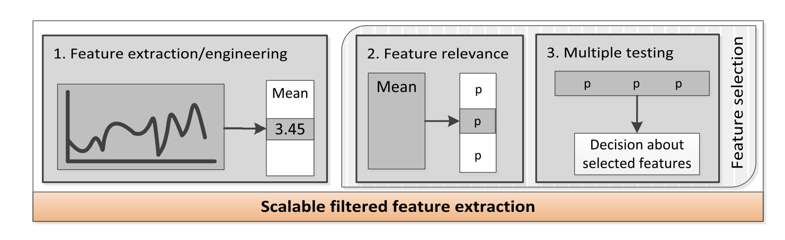
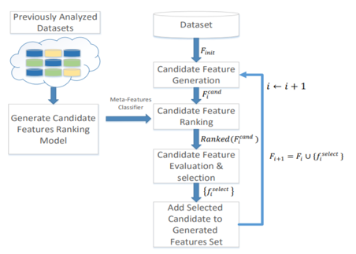

# Untitled

**3. TsFresh:**

Time Series Feature Engineering is a time consuming process as the Data Scientist or engineers have to consider the multifarious algorithms of signal processing and time series analysis for identifying and extracting meaningful features from time series.\[5\]

TsFresh\(Time Series Feature Extraction on the basis of Scalable Hypothesis tests\) is an open source python package for automatically extracting a large number of meaningful features for time series data. This package implements standard APIs of time series and machine learning libraries \(eg : pandas and scikit learn\) and is designed for exploratory analysis as well as straightforward integration into operational data science applications.

TsFresh is based on the FRESH algorithm\[6\].

It is the only python library available for this type of data. There is a matlab package called [hctsa](https://github.com/benfulcher/hctsa) which can be used to automatically extract features from time series. It is also possible to use hctsa from within python by means of the [pyopy](https://github.com/strawlab/pyopy) package.

**Fig2: 3 steps of tsFresh Feature Engineering**

As shown in above figure TsFresh involves 3 steps:

1. Feature Extraction
2. P-value calculation
3. Multiple test procedure

**4. Cognito:**

**5. ExploreKit:**

**Feature generation:**

Steps involved:

1. Apply Unary operators on all possible features in the feature set\(Fu,i\)

Discretization: EqualRange discretization for numerical features, daytime feature into DayOfWeek/MonthOfYear/IsWeekend,

Normalization: To fit the scale of continuous \(i.e. numeric\) features to specific distributions \(range\[0,1\]\)

2. Apply the binary and higher-order operators on the unified set Fi ∪ Fu,i\(Fo,i\)

Binary: arithmetic operators\(+,−,×,÷\)

Higher-order: SQL based operations\(_GroupByThenMax_, _GroupByThenMin_, _GroupByThenAvg_, _GroupByThenStdev_ and _GroupByThenCount_\)

3. Once again apply unary operators on all the final features

**Ranking Candidate Features:**

Novel ML based approach generates a set of _meta-features_ Fi,jmeta for each fi,jcand and then Ranking classifier assigns score to each candidate feature

Types of meta-features:

1. **Dataset based meta-features :** Every dataset has multiple characteristics that may affect the likelihood of fcand being effective.

General information: general statistics \(like number of instances and classes, stats on size\)

Initial evaluation: stats on current performance of classifier when applied on initial set of features\(like AUC, log loss and precision value\)

Entropy-based measures: grouping initial features based on type and then calculate stats on information gain of the features

Feature diversity: using chi-squared and t-test to calculate similarity. Using tests stats to create meta-features

2. **Candidate based meta-features:** Represent interaction of candidate features w.r.t initial features

Entropy and statistical tests for the candidate feature: use the chi-squared and paired t-tests to derive statistics on candidate features correlation to each groups\(type-based group\) also derive entropy-based measures

General information on parent features and operators: stats representing type of each parent feature, the range of possible values and the number and type of operators used.

Statistical tests on parent features: derive statistics on the inter-correlation of the parent features as well as their correlation with the remaining features of the initial feature set.

**Training Ranking classifier:**

To train the classifier we need a large labeled training set.

Steps:

1. For training dataset, generate set of candidate features

2. Generate meta-features for each candidate feature

3. assigning labels \(“good” or “bad”\) to each candidate feature generated for training dataset.

more computationally-expensive \(wrapper\) feature evaluation methods is used to determine the error reduction obtained by applying the classifier on the joint set F ∪ {f cand,i }.

If the error declines by more than ε, we label candidate features as “good” and “bad” otherwise.

We assign these labels to the meta-features and use the labeled set to train Classifier.

**Candidate Feature Evaluation and Selection:**

evaluate the performance of the classifier on the joint feature and set Fi ∪ {fi,j }. The evaluation is conducted using k-fold cross validation. The evaluation continues until either:

E\(F ∪ {fcand}\) + ε ≤ E\(F \), where E measures the error and εw is a predefined parameter or the number of evaluated candidate features exceeded a predefined parameter. In this case, the highest performing member of RankedFcand is chosen, given that it exceeds the minimal threshold.

**6. OneBM:**

**7. Pyfeat:**

**8. AutoLearn:**

